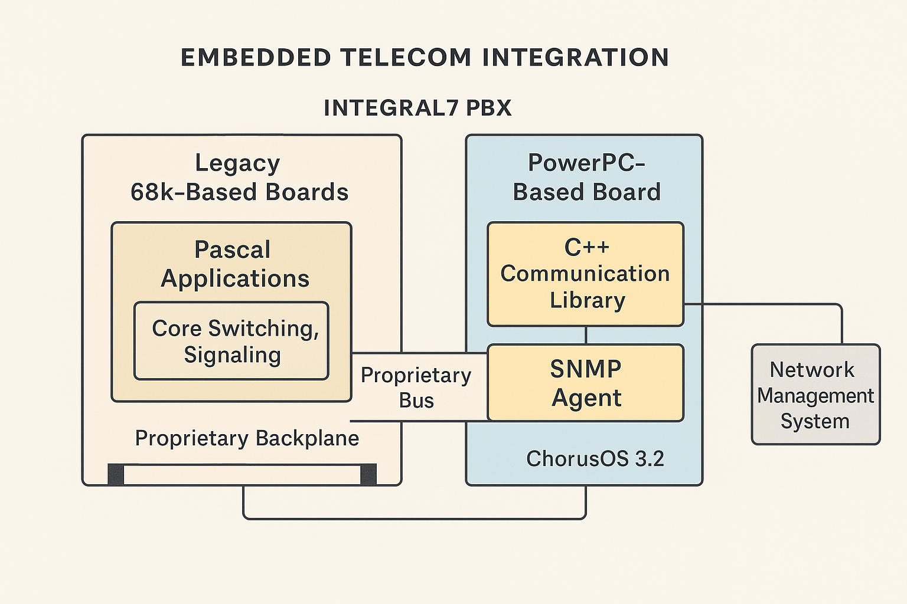

# Bosch Telecom (1997-1998)

This directory contains artifacts from **Julien Simon's** time at **Bosch Telecom** in Louveciennes, France, where he worked as a **Systems Software Engineer** on the Integral7 PBX—an embedded enterprise telecom platform deployed across Europe.

## 🏢 Project Overview

At Bosch Telecom (1997–1998), I was responsible for the full design, development, and validation of a real-time C++ communication library that bridged legacy PBX internals with a modern SNMP-based management interface.

The Integral7 system combined Motorola 68k-based legacy boards—running Pascal applications for core switching—with a PowerPC board running **ChorusOS 3.2**, a real-time microkernel operating system. The communication library I built allowed SNMP agents running on the ChorusOS board to interact seamlessly with the Pascal-based switching logic, without exposing the complexity of the underlying proprietary backplane or legacy codebase.

*Architecture diagram showing the integration between legacy Motorola 68k boards (Pascal-based switching) and the PowerPC board running ChorusOS with SNMP management interface*

The project required deep integration work. I abstracted a proprietary inter-board communication protocol into a clean C++ API that provided structured access to PBX metrics such as call activity, port status, alarms, and system alerts. The interface supported both polling and event-driven modes, enabling compatibility with standard SNMP query and trap mechanisms.

My library was fully multithreaded and designed to operate reliably under the deterministic constraints of an RTOS. I used ChorusOS-native threading and synchronization primitives to coordinate data access between polling threads, trap-generation threads, and SNMP service layers. Because the SNMP agent ran locally on the embedded board, the library enabled low-latency access to live PBX data without network round trips or system load penalties.

Development was done on a Solaris workstation, with cross-compilation and deployment to the PowerPC-based ChorusOS board. I completed the entire lifecycle: system design, implementation, test automation, integration, documentation, and final user acceptance testing (UAT).

I also collaborated remotely with a team of around 20 application developers in Bangalore and Frankfurt, providing architectural guidance, integration support, and troubleshooting assistance throughout the development cycle.

This project placed me squarely at the intersection of telecom infrastructure, embedded systems, and network management. It was a deeply technical and rewarding role that strengthened my skills in low-level systems programming, real-time design, and cross-domain software integration.

## 🛠️ Technologies & Expertise

### Embedded Systems
- **ChorusOS 3.2**: Real-time microkernel operating system
- **PowerPC Architecture**: Embedded processor development
- **Motorola 68k**: Legacy processor integration
- **Real-time Programming**: Deterministic system design

### Communication Protocols
- **SNMP**: Network management protocol implementation
- **Proprietary Backplane**: Inter-board communication protocol
- **C++ Libraries**: Communication library development
- **Multithreading**: Concurrent system design

### Development Environment
- **Solaris Workstation**: Development and cross-compilation
- **Cross-compilation**: PowerPC target development
- **Test Automation**: Automated testing and validation
- **Documentation**: Technical specifications and user guides

## 📊 Technical Achievements

### System Integration
- **Legacy Integration**: Bridged Pascal-based switching with modern SNMP
- **Real-time Performance**: Low-latency access to live PBX data
- **Reliability**: Deterministic operation under RTOS constraints
- **Scalability**: Support for multiple SNMP agents and polling modes

### International Collaboration
- **Remote Teams**: Worked with developers in Bangalore and Frankfurt
- **Architectural Guidance**: Provided technical leadership across teams
- **Integration Support**: Assisted with cross-domain software integration
- **Troubleshooting**: Resolved complex technical issues

## 📄 Archive Notes

- Architecture diagram preserved showing system integration
- Technical documentation demonstrates embedded systems expertise
- Project showcases early experience with real-time systems
- International collaboration experience with distributed teams

## 🔗 Related Links

- **[Main Repository](../../README.md)** - Complete work history overview
- **[julien.org](https://julien.org)** - Julien's current work and expertise

---

*This project demonstrates Julien's early expertise in embedded systems, real-time programming, and complex system integration, laying the foundation for future technical leadership roles.*

---

### 📚 References

1. **ChorusOS 3.2 — Real-Time Operating System**
   Version 3.2 of ChorusOS was widely used in telecom and industrial embedded systems in the mid-1990s. It supported lightweight threads, deterministic scheduling, and message-passing suited for fault-tolerant designs.

   * Source: [Sun ChorusOS 3.x and 5.0 Documentation (Archived by Oracle)](https://docs.oracle.com/cd/E19085-01/chorus.5.0/)
   * Historical mentions: Chorus Systèmes SA whitepapers (1994–1997), telecom industry use cases

2. **Internal Bosch Documentation (Proprietary)**
   Most details about the Integral7 PBX architecture—including Pascal-based call-processing code, proprietary backplane protocol, and SNMP integration—came from internal engineering documents, many written in German. These were accessible only to Bosch staff and project partners.

3. **Bosch Integral PBX Product Line**
   Integral7 was part of Bosch’s broader Integral PBX family, which included models like the Integral 3, 5, 33, and 55.

   * Reference: [PBX Bosch Integral V3.0 – Overview from MyNavoice (PDF)](https://www.yumpu.com/en/document/view/19723135/pbx-bosch-integral-v30pdf-mynavoice)

4. **SNMP Runtime Library Integration (Bosch / WBOM Project)**
   Bosch used C++ runtime libraries to bridge between PBX internals and SNMP agents. This strategy was documented in EU-funded projects such as WBOM (Wideband Object Management).

   * Source: WBOM Final Report (Bosch Telecom, 1997), EU CORDIS archive

5. **SNMP Standards (v1, v2c) Used in Telecom During 1990s**

   * [RFC 1157 – SNMPv1](https://datatracker.ietf.org/doc/html/rfc1157)
   * [RFC 1905 – SNMPv2c](https://datatracker.ietf.org/doc/html/rfc1905)

6. **Bosch Telecom Company History and Evolution**
   Bosch Telecom evolved from Telenorma and was later rebranded as Tenovis before being acquired by Avaya in 2004.

   * [Tenovis company history – Wikipedia](https://en.wikipedia.org/wiki/Tenovis)
   * [Avaya acquisition of Tenovis – Official press release (2004)](https://www.avaya.com/en/about-avaya/newsroom/pr-archive/2004/pr-041008/)
